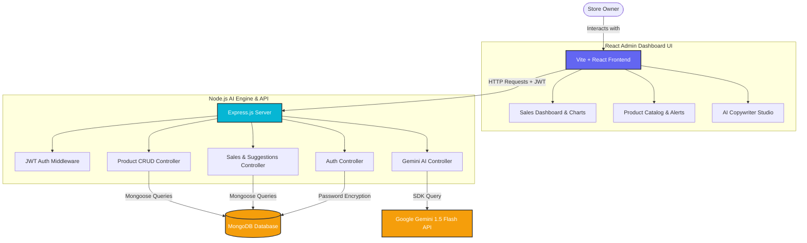

# SmartStore AI (AI E-commerce Admin Assistant) 🚀

SmartStore AI is a premium, state-of-the-art e-commerce administrative assistant platform built for online store owners. Powered by the MERN stack (MongoDB, Express, React, Node.js) and integrated with **Google Gemini API**, SmartStore AI transforms store management into an "agent-first" autonomous experience—providing owners with AI-generated SEO copy, real-time dynamic pricing advice, inventory restock alerts, and interactive revenue chart analytics.

---

## 📸 Media, Videos & Screenshots

### 🖥️ Dashboard Overview
*(Place your dashboard screenshots here)*
> **[INSERT SCREENSHOT: Premium Obsidian Dark-Mode Dashboard showing Chart.js Line Chart and Doughnut Chart]**

### ✍️ AI Content Writing Studio
*(Place your AI Studio screenshots here)*
> **[INSERT SCREENSHOT: Generating optimized descriptions and SEO tags using Gemini API with sparkly shimmers]**

### 📹 Video Demonstration & Walkthrough
*(Embed your project presentation video here)*
> **[INSERT VIDEO DEMO LINK: 3-minute video showing signup, adding a product, and generating AI descriptions]**

---

## 🏗️ System Architecture

SmartStore AI utilizes a decoupled client-server architecture. The frontend React client communicates with the Node.js Express API engine via protected JSON Web Tokens (JWT).



---

## 🗄️ Database Schemas

### 1. Store Owner Schema (`User`)
Stores authorization and credential records of registered store owners.
| Field | Type | Attributes | Description |
| :--- | :--- | :--- | :--- |
| `_id` | ObjectId | Primary Key | Unique owner identifier |
| `storeName` | String | Required | Custom brand name of owner store |
| `email` | String | Unique, Required | Authentication email login ID |
| `password` | String | Required, Hidden | Hashed passwords using bcryptjs |
| `createdAt` | Date | Default: Now | Date user registration occurred |

### 2. Product Schema (`Product`)
Captures inventories and registers AI optimized copy parameters.
| Field | Type | Attributes | Description |
| :--- | :--- | :--- | :--- |
| `_id` | ObjectId | Primary Key | Unique product identifier |
| `userId` | ObjectId | Ref: `User` | Maps product to store owner |
| `title` | String | Required | Product display name |
| `description` | String | Optional | Optimized product description text |
| `price` | Number | Required | Core selling price |
| `category` | String | Required | Product department category |
| `stock` | Number | Required, Default: 0 | Current stock units count |
| `tags` | Array [String] | Optional | Strategic SEO meta tags |
| `marketingCaption` | String | Optional | Prewritten social media promo caption |
| `salesVelocity` | Number | Default: 0 | Units sold per month (used by AI metrics) |
| `revenue` | Number | Default: 0 | Total accumulated product sales revenue |

### 3. Timeline Transactions (`Sales`)
Captures detailed month-by-month sales data for historic plotting.
| Field | Type | Attributes | Description |
| :--- | :--- | :--- | :--- |
| `_id` | ObjectId | Primary Key | Unique transaction log identifier |
| `userId` | ObjectId | Ref: `User` | Maps log to store owner |
| `productId` | ObjectId | Ref: `Product` | Maps log to specific product item |
| `amount` | Number | Required | Amount calculated for transaction |
| `quantity` | Number | Required | Units volume sold |
| `month` | String | Required | Month string (e.g. 'Jan', 'Feb') |

---

## 🛠️ Installation & Setup Guide

Follow these simple steps to run SmartStore AI locally on your system.

### Prerequisites
*   Node.js (v18.0.0 or higher recommended)
*   MongoDB Local or MongoDB Atlas URI
*   Google Gemini API Key *(Optional, will fallback to a dynamic mockup engine if not set)*

### Step 1: Clone and Set Up Workspace
Ensure your folder layout is structured as follows:
```
SmartStore AI (AI E-commerce Admin Assistant)/
├── backend/
└── frontend/
```

### Step 2: Configure Backend Environment
1. Navigate to the backend folder:
   ```bash
   cd backend
   ```
2. Install node package dependencies:
   ```bash
   npm install
   ```
3. Create a `.env` file from the example:
   ```bash
   cp .env.example .env
   ```
4. Open the newly created `.env` file and populate it with your credentials:
   ```env
   PORT=5000
   MONGO_URI=mongodb+srv://<username>:<password>@cluster0.mongodb.net/smartstore
   JWT_SECRET=your_super_secret_jwt_key_here
   GEMINI_API_KEY=your_gemini_api_key_here
   ```

### Step 3: Run the Backend Engine
Run the express API server in development mode:
```bash
npm run dev
```
*(The server will start running on http://localhost:5000)*

### Step 4: Configure Frontend
1. Navigate to the frontend folder:
   ```bash
   cd ../frontend
   ```
2. Install npm packages:
   ```bash
   npm install
   ```
3. Run the Vite developer preview:
   ```bash
   npm run dev
   ```
*(The client dashboard UI will compile and run on http://localhost:5173)*

---

## ⚡ Key Feature Walkthrough

### 🔒 User Authorization
Register a fresh account from scratch. A secure password hashing scheme protects your master password. Upon successful registration, a secure JWT session token is created, keeping you logged in.

### 📊 Metric Analytics & Chart.js Visuals
When you add products, SmartStore AI automatically maps sales velocity to calculate dynamic total revenue. The dashboard renders:
*   **Revenue Timeline (Line Chart):** Captures monthly growth distributions using responsive, custom-styled grids.
*   **Volume Breakdown (Doughnut Chart):** Details category distributions, keeping you updated on popular departments.

### 💡 Interactive AI pricing Suggestions
The autonomous suggestion panel tracks sales velocity vs. inventory levels:
*   **Urgent Restock Signals:** If stock falls `<= 10`, it evaluates unit depletion rates and forecasts the exact remaining days until stockout.
*   **Profit Opportunities:** High sales velocity combined with depleted stock triggers a pricing optimization alert. Clicking the **"Apply Price"** button instantly updates the price in the database!

### ✍️ AI Content & Copywriter Studio
Enter a product title and department category. Click the glowing **"Generate AI Optimizations"** button. The Gemini API evaluates keywords, returning:
1.  A professional, marketing-grade e-commerce product description.
2.  Exactly 5 strategic SEO tags.
3.  An engaging social media post caption with hashtags.
Click **"Publish to Catalog"**, input a price and stock, and the generated content is instantly saved as a new active listing in your store catalog!
